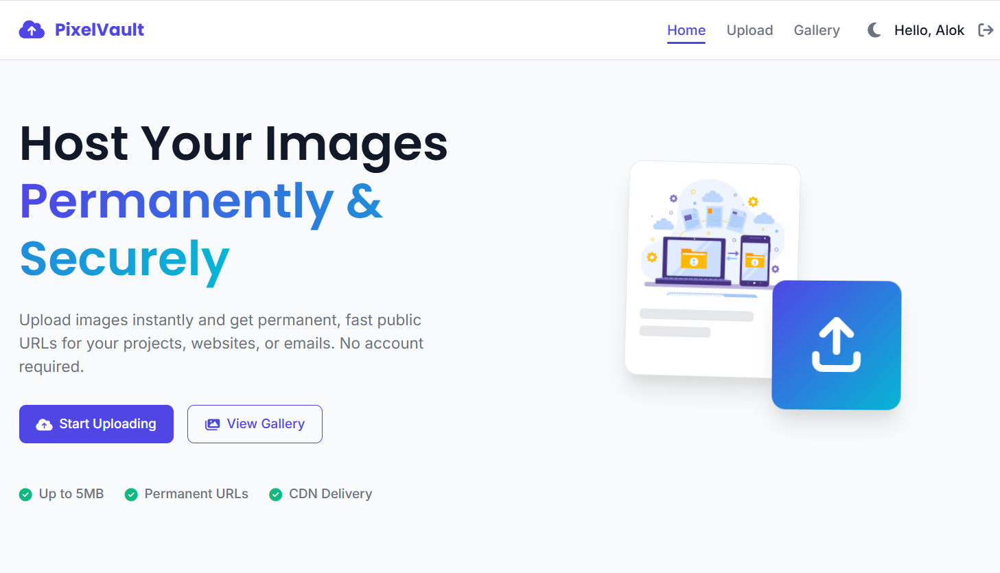
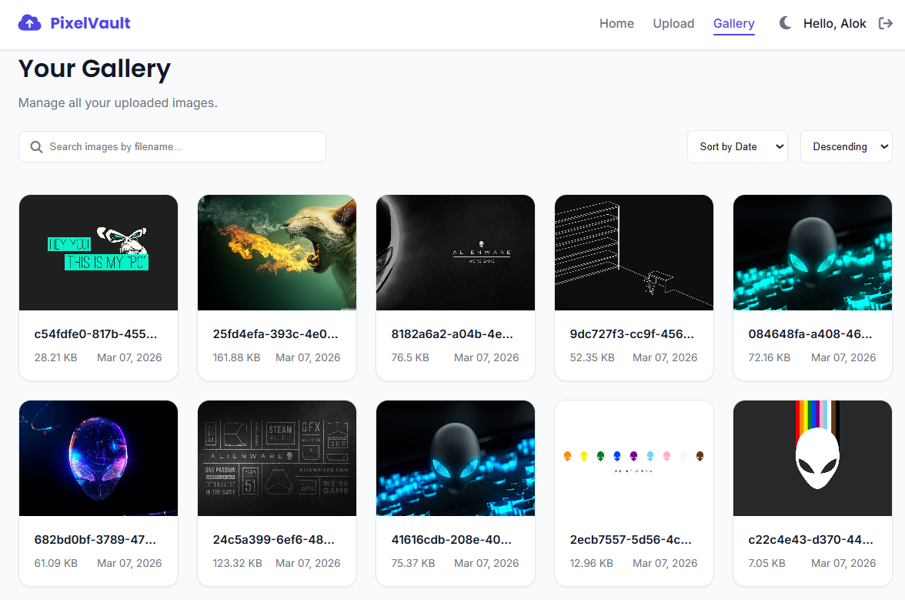
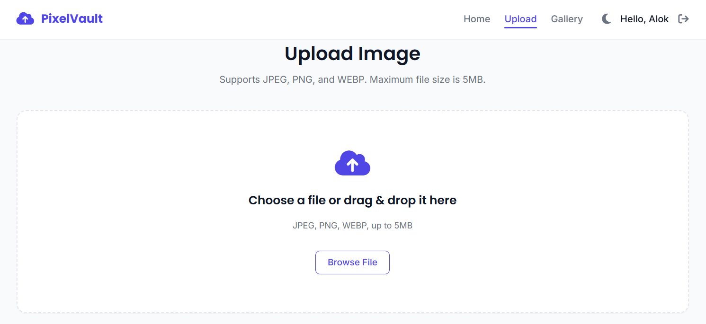

# PixelVault – Image Hosting & Media API


PixelVault is a **production-ready full-stack MERN application** designed as a lightweight **Image Hosting Platform & Media API**.

Users can upload images, manage private galleries, and generate **permanent CDN-powered public image URLs** that can be embedded across websites and applications.

The system demonstrates **modern SaaS UI design, optimized image processing, secure authentication, and scalable cloud storage architecture.**

---

# 🌐 Live Demo

Frontend  
https://pixel-vault-frontend-mpin.onrender.com/

Backend API  
https://pixel-vault-kd40.onrender.com

---

# 🚀 Features

## 🔐 Authentication & Security

- Secure **JWT Authentication**
- Password hashing using **bcrypt**
- Protected API routes via middleware
- Secure authentication cookies
- Rate limiting for API protection

---

## 🖼 Image Hosting

- Upload images with drag-and-drop
- Automatic image compression
- Image optimization using **Sharp**
- Storage using **Cloudinary CDN**
- Permanent public image URLs

Example URL

```
https://res.cloudinary.com/<cloud-name>/image/upload/vxxxx/pixelvault/image.webp
```

---

## 👤 Multi-User System

- Complete **user data isolation**
- Each user has a **private gallery**
- Images are stored per user

---

## ⚡ Advanced Gallery

- Infinite scrolling with **IntersectionObserver**
- Image search by filename
- Sorting by **date / size**
- Responsive grid layout

---

## 🎨 Modern UI

- Glassmorphism UI design
- Skeleton loaders
- Responsive layouts
- Clean SaaS interface

---

# 🛠 Tech Stack

## Frontend

- React (Vite)
- React Router
- Axios
- React Dropzone

---

## Backend

- Node.js
- Express.js
- MongoDB
- Mongoose
- JWT Authentication
- Multer (file upload middleware)
- Sharp (image optimization)
- Cloudinary (image storage + CDN)
- Nodemailer (email service)

---

## Styling

- Pure CSS
- Responsive Grid Layout

---

# 🧠 System Architecture

```
React Client
      │
      │ REST API
      ▼
Node.js + Express Server
      │
      │
MongoDB Atlas (Metadata)
      │
      │
Cloudinary CDN (Image Storage)
```

---

# ⚙️ Image Processing Pipeline

```
User Upload
     │
     ▼
Multer Memory Storage
     │
     ▼
Sharp Image Compression
     │
     ▼
Cloudinary Upload
     │
     ▼
MongoDB Metadata Save
     │
     ▼
Frontend Gallery Display
```

---

# ⚙️ Installation & Setup

## 1️⃣ Clone the Repository

```bash
git clone https://github.com/rrrsahil/Pixel-Vault.git
cd Pixel-Vault
```

---

## 2️⃣ Install Dependencies

Backend

```bash
cd server
npm install
```

Frontend

```bash
cd client
npm install
```

---

## 3️⃣ Environment Variables

Create `.env` inside **server folder**

```
PORT=5000

MONGODB_URI=your_mongodb_connection

JWT_SECRET=your_secret

CLOUDINARY_CLOUD_NAME=your_cloud_name
CLOUDINARY_API_KEY=your_api_key
CLOUDINARY_API_SECRET=your_api_secret

MAIL_HOST=smtp_provider
MAIL_PORT=587
MAIL_USER=your_email
MAIL_PASS=your_password
```

⚠️ `.env` should **never be committed to GitHub**

---

## 4️⃣ Run Development Server

Backend

```bash
cd server
npm run dev
```

Frontend

```bash
cd client
npm run dev
```

---

## 5️⃣ Open in Browser

```
http://localhost:5173
```

---

# 📂 Project Structure

```
pixel-vault
│
├── client
│   ├── public
│   ├── src
│   │   ├── components
│   │   ├── pages
│   │   ├── services
│   │   └── styles
│
├── server
│   ├── config
│   │   └── cloudinary.js
│   ├── controllers
│   ├── middleware
│   ├── models
│   ├── routes
│   └── server.js
│
└── README.md
```

---

# 📘 API Overview

| Method | Endpoint | Description |
|------|------|------|
| POST | /api/auth/register | Register user |
| POST | /api/auth/login | Login user |
| POST | /api/upload | Upload image |
| GET | /api/images | Fetch images |
| DELETE | /api/images/:id | Delete image |

---

# 🛡 Security

- Password hashing using **bcrypt**
- JWT authentication
- Protected API routes
- File upload validation
- Rate limiting
- Private user galleries

---

# ⚡ Performance Optimizations

- Image compression using **Sharp**
- CDN delivery via **Cloudinary**
- Lazy loading images
- Infinite scrolling gallery

---

# 🖼 Screenshots

## Home Page



---

## Gallery Page



---

## Upload Page



---

# 🚀 Deployment

## Backend

Recommended platforms

- Render
- Railway
- DigitalOcean

---

## Frontend

Recommended platforms

- Vercel
- Netlify

---

# 📈 Future Improvements

- Image drag-and-drop bulk upload
- Image analytics
- Image download tracking
- AI image tagging
- Public galleries
- API access tokens

---

# 🤝 Contributing

Contributions are welcome.

1. Fork the repository
2. Create new branch
3. Commit changes
4. Open Pull Request

---

# 🐞 Issues

If you encounter any issues please create a GitHub issue.

---

# 👨‍💻 Author

Alok Pandit

GitHub  
https://github.com/rrrsahil

---

# 📜 License

Distributed under the MIT License. See  for more information.
